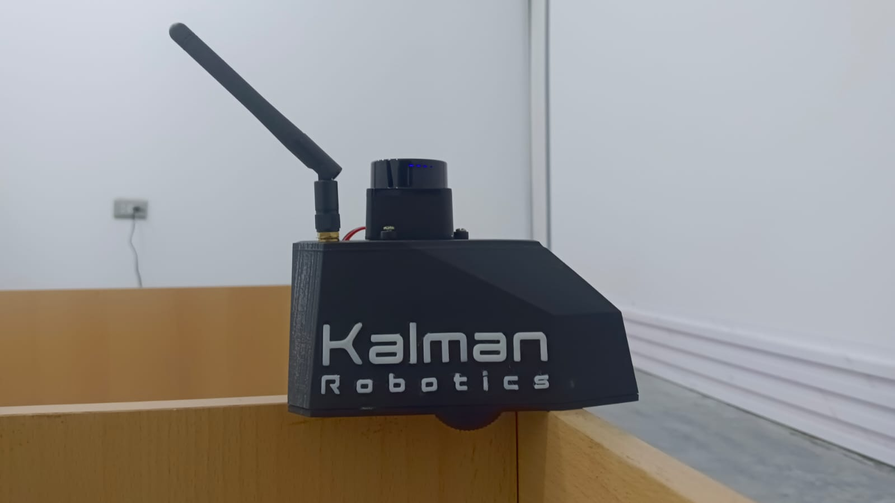

# Kit-Kalman-ROS2

Paquetes ROS2 para el Kit Kalman de Kalman Robotics.



- [Kit-Kalman-ROS2](#kit-kalman-ros2)
  - [Paquetes ROS2 del Kit Kalman de Kalman Robotics](#paquetes-ros2-del-kit-kalman-de-kalman-robotics)
  - [Requisitos](#requisitos)
    - [Software](#software)
    - [Hardware](#hardware)
  - [Clonación, instalación de dependencias y compilación](#clonación-instalación-de-dependencias-y-compilación)
  - [Uso general de los paquetes ROS2 para el robot](#uso-general-de-los-paquetes-ros2-para-el-robot)
    - [1. Ejecutar el agente de micro-ROS](#1-ejecutar-el-agente-de-micro-ros)
    - [2. Lanzamiento inicial del robot](#2-lanzamiento-inicial-del-robot)
    - [- Teleoperación](#--teleoperación)
    - [-  IMU](#---imu)
    - [- Mapeo](#--mapeo)
    - [- Navegación autónoma](#--navegación-autónoma)
  - [Demo de navegación autónoma](#demo-de-navegación-autónoma)
  - [Uso del repositorio para modificaciones del robot](#uso-del-repositorio-para-modificaciones-del-robot)
  - [Agradecimientos especiales](#agradecimientos-especiales)

## Paquetes ROS2 del Kit Kalman de [Kalman Robotics](https://kalmanrobotics.io/)
- **kalman**: meta-paquete que agrupa todos los paquetes relacionados con el Kit Kalman.
- **kalman_bringup**: paquete multifuncional de lanzamiento para iniciar el robot con diversas configuraciones.
- **kalman_description**: contiene la descripción URDF del robot Kalman.
- **kalman_gazebo**: simulaciones en el entorno Gazebo.
- **kalman_interfaces**: definiciones de interfaces personalizados.
- **kalman_telemetry**: gestión de la telemetría del robot.
- **kalman_teleop**: control remoto del robot.
- **kalman_imu**: utilidades varias para el robot.

## Requisitos

### Software

1.  **GIT** - [Descargar](https://git-scm.com/downloads)
2. **VS Code** - [Descargar](https://code.visualstudio.com/)
3. **ROS2 Humble** - [Instalar](https://docs.ros.org/en/humble/Installation.html)
4. **micro-ROS** - [Instalar](https://micro.ros.org/docs/tutorials/core/first_application_linux/)

### Hardware
1. **Kit Kalman** - [Cargar firmware](https://github.com/Kalman-Robotics/kit-kalman-firmware)

## Clonación, instalación de dependencias y compilación

<details>
<summary>1. Clonación del repositorio y submódulos</summary>

- Dentro de la carpeta `ros2_ws/src/`, clonar el repositorio:
```bash
git clone https://github.com/Kalman-Robotics/kit-kalman-ros2
```
- Inicializar y actualizar submódulos
```
cd kit-kalman-ros2
git submodule update --init --recursive
```
</details>

<details>
<summary>2. Instalación de dependencias</summary>

```
rosdep update
cd ~/kalman_ws
rosdep install --from-paths src --ignore-src -r -y
```
</details>

<details>
<summary>3. Compilación del proyecto</summary>

- Volver a la carpeta raíz del workspace y compilar:
```bash
cd ~/ros2_ws
colcon build --packages-up-to kalman
source install/setup.bash
```
</details>

## Uso general de los paquetes ROS2 para el robot

> [!NOTE] Para ver más información de los archivos launch y sus argumentos, consultar el README de cada paquete de este proyecto.

### 1. Ejecutar el agente de micro-ROS
Ejecutamos el agente de micro-ROS en la computadora para establecer la comunicación con el robot, de esta manera podremos interactuar con los tópicos publicados por el robot.
```
ros2 run micro_ros_agent micro_ros_agent udp4 --port 8888 -i <IP_DE_LA_COMPUTADORA>
```
Comprobar que los tópicos están disponibles con `ros2 topic list`

### 2. Lanzamiento inicial del robot
Este launch file inicia los nodos de telemetría y publica el estado del robot en TF utilizando el archivo URDF. Opcionalmente permite iniciar RViz y Micro-ROS.
```
ros2 launch kalman_bringup kalman_bringup.launch.py lidar_model:=LDROBOT-LD19 use_sim_time:=false use_rviz:=true use_uros:=false
```

### - Teleoperación
Este ejecutable permite controlar el robot mediante el teclado considerando los límites de velocidad del robot:
```
ros2 run kalman_teleop teleop_keyboard
```
Sin embargo, podría utilizar otros paquetes de teleoperación como `teleop_twist_keyboard` o `joy` para control mediante joystick.

### -  IMU
Este launch file inicia el nodo de procesamiento del IMU, incluyendo una autocalibración:
```
ros2 launch kalman_imu imu_processor.launch.py
```

### - Mapeo
Se lanza Cartographer para mapeo y localización:
```
ros2 launch kalman_bringup cartographer.launch.py use_sim_time:=false
```
Para guardar el mapa generado:
```
ros2 run nav2_map_server map_saver_cli -f mapa_kalman
```

### - Navegación autónoma
- Los archivos del mapa deben estar en el directorio `map` dentro del paquete `kalman_bringup`. Sus nombres deben ser `mapa_kalman.yaml` y `mapa_kalman.pgm`.
- Luego, lanzar la navegación sin SLAM:
```
ros2 launch kalman_bringup navigation.launch.py use_sim_time:=false robot_model:=kalman_description slam:=False
```
- Al abrirse RViz, establecer la posición inicial del robot utilizando la herramienta "2D Pose Estimate".
- Para mejorar la localización, puede girar el robot manualmente o utilizar el teleoperador.
- En RViz, utilizar la herramienta "2D Nav Goal" para especificar la ubicación objetivo; el robot se desplazará automáticamente hacia esa ubicación utilizando el mapa existente.

---

## Demo de navegación autónoma

En este 1er video el robot se localiza en un mapa preexistente y mediante RVIZ se le asigna un punto objetivo al que debe llegar. Posteriormente este visualizador muestra en tiempo real la planificación de la ruta que el robot debe seguir para llegar al objetivo evitando obstáculos.

<video controls style="width:66%;" src="https://github.com/user-attachments/assets/27162948-e6a4-496f-940a-d97bb359d9fe">
  Tu navegador no soporta el elemento <code>video</code>.
</video>

En este 2do video se observa al robot real navegando de forma autónoma hacia el objetivo previamente asignado en el mapa. 

<video controls style="width:33%;" src="https://github.com/user-attachments/assets/a1f37ff9-4a41-4fec-8ec5-0f23e93b9023">
  Tu navegador no soporta el elemento <code>video</code>.
</video>
</details>

---

## Uso del repositorio para modificaciones del robot
`kalman_description` es el paquete del modelo de robot predeterminado. 

Si utiliza un modelo modificado del robot deberá indicarlo con el argumento `robot_model:=paquete_model_modificado` en los archivos de lanzamiento correspondientes.

Cabe resaltar que otros paquetes de descripción de robots deberán seguir la misma estructura que `kalman_description` para asegurar la compatibilidad con los archivos de lanzamiento y demás paquetes dependientes.

---

## Agradecimientos especiales
Agradecemos especialmente al equipo de Kaia.ai. Este trabajo en ROS2 se ha desarrollado tomando como base su trabajo y recursos; muchas de las ideas y la arquitectura inicial provienen de su aporte. El repositorio presentando aquí es una adaptación y modificación del trabajo original de [Kaia.ai](https://blog.kaia.ai/) para integrarlo con ROS2 y las particularidades del Kit Kalman. 
